# ⚡ Dheeraj R S
### Full Stack Developer & Systems Engineer

 

<!-- ================= PROFILE CARDS (TERMINAL & NEOFETCH) ================= -->

  
  

 

<!-- ================= CONTRIBUTION GRAPH ================= -->

  

 

---

## 👨‍💻 About Me

I'm <b>Dheeraj R S</b>, a dedicated <b>Full Stack Developer &amp; Systems Engineer</b> focused on architecting resilient backend systems, crafting pixel-perfect reactive interfaces, and building high-performance web applications.

- 🔭 **Current Focus:** Engineering reactive, scalable web applications with **React.js, Next.js, TypeScript**, and **Node.js**
- ⚡ **Engineering Philosophy:** Clean code, modular architecture, low-latency APIs, and zero-compromise UX
- 💬 **Ask Me About:** Modern JavaScript/TypeScript, RESTful APIs, distributed database schemas, and microservice patterns
- 🌱 **Continuous Growth:** Exploring cutting-edge cloud architectures, system scalability, and high-velocity UI design

---

## 🛠 Tech Stack & Core Competencies

<!-- Languages & Runtimes -->

  <b>Languages &amp; Runtimes</b> 
  
  
  
  
  

<!-- Frontend -->

  <b>Frontend Engineering</b> 
  
  
  
  

<!-- Backend & APIs -->

  <b>Backend &amp; Microservices</b> 
  
  
  

<!-- Databases & Caching -->

  <b>Databases &amp; Caching</b> 
  
  
  
  

<!-- DevOps & Workflow -->

  <b>DevOps &amp; Workflow</b> 
  
  
  
  
  

---

## 🌟 Featured Projects

### 🌐 1. Website Builder (`website-builder`)
> **Build &amp; launch a professional website in under 1 minute — completely code-free.**

- ⚡ **No-Code Instant Creation:** Choose from a rich gallery of responsive templates or assemble completely custom layouts from scratch with full visual freedom.
- 🔄 **Direct GitHub Code Push:** Seamlessly authenticates with the user's GitHub account, pushing clean, maintainable source code directly to their personal repository.
- 🚀 **One-Click Live Deployment:** Publish immediately to the web with zero manual server configuration.
- 🛠 **Effortless Future Updates:** Code stays version-controlled in the user's repository — open, customize, and re-deploy anytime.

👉 [**Explore Project on GitHub →**](https://github.com/dheeraj-rs/website-builder)

 

### 🎨 2. Poster Maker (`poster-maker`)
> **Dynamic product showcase &amp; marketing poster studio for any industry.**

- 🎯 **Instant Product Showcasing:** Easily plug in product imagery, promotional highlights, and branding to generate market-ready visual posters in seconds.
- 📐 **Trending &amp; Custom Templates:** Access an ever-updating library of high-converting templates or design brand-aligned marketing collateral from a blank canvas.
- 💎 **High-Resolution One-Click Download:** Real-time design canvas with instant high-quality export ready for social media advertising, retail promotions, e-commerce banners, or print.
- 🛒 **Designed For:** Retail shops, digital marketers, product creators, and agencies seeking stunning visual assets without complex design software.

👉 [**Explore Project on GitHub →**](https://github.com/dheeraj-rs/poster-maker)

 

### 💼 3. Business Notes (`business-notes`)
> **Complete CRM, accounting &amp; store management suite built for business and shop owners.**

- 📊 **Full-Fledged Financial Accounting:** Streamline daily sales records, operational expenses, customer debit/credit ledgers (udhar tracking), and profit analytics in one clear dashboard.
- 📦 **Product &amp; Inventory Management:** Organize product inventories, pricing structures, stock alerts, and vendor details with zero spreadsheet headaches.
- 👥 **Comprehensive Customer &amp; Order CRM:** Keep detailed customer notes, transaction histories, and contact logs organized to build long-term customer relationships.
- 🔒 **Secure &amp; Zero-Code:** Built for shopkeepers, service businesses, and freelancers needing a complete business operating system with zero coding required.

👉 [**Explore Project on GitHub →**](https://github.com/dheeraj-rs/business-notes)

---

## 🤝 Let's Connect & Collaborate

  Always open to discussing <b>scalable web architectures</b>, <b>impactful product engineering</b>, or <b>exciting opportunities</b>.

&nbsp;

&nbsp;

&nbsp;

 